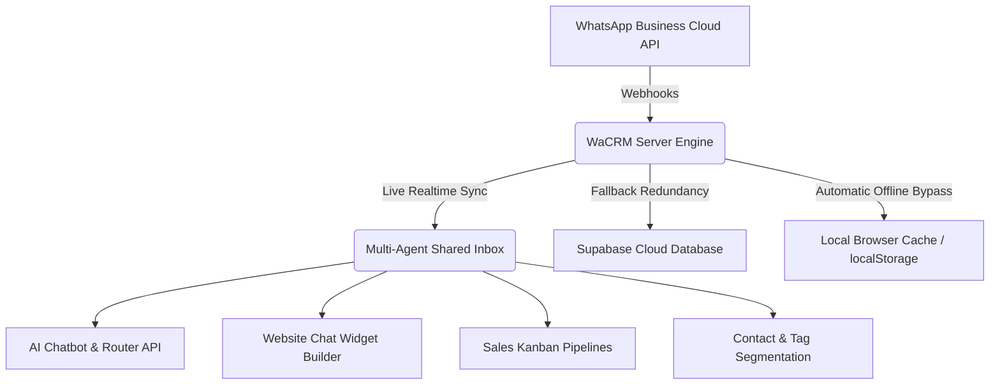

# 📱 Metro Lodge Group — Premium Self-Hostable WhatsApp® CRM & Marketing Automation

> **Fork it, brand it, host it, own it.**  
> A premium, fully self-hostable, production-ready WhatsApp® Business API CRM. Featuring a multi-agent shared inbox, automated contact segmentation, multi-stage sales pipelines, broadcast messaging, visual no-code automations, AI chatbot/router integration, and dynamic website chat widgets. **Zero seat limits, zero subscription fees.**

[](https://www.hostinger.com/web-apps-hosting)
[](https://vercel.com)
[](./LICENSE)
[-black?logo=nextdotjs)](https://nextjs.org)
[](https://supabase.com)
[](https://tailwindcss.com)

---

## 🌟 Premium Features Overview

WaCRM is built to bypass expensive per-seat SaaS fees, providing you with a high-end customer management system.



### 👥 1. Team & Agent Management (100% Direct UI CRUD)
*   **Shared Inbox Collaborator**: Multiple agents can respond, reassign, add internal comments, and tag conversations in real-time.
*   **Full UI Controls**: Invite new team members, edit access scopes, customize tasks, and permanently remove team members directly from the dashboard.
*   **Granular Checkbox Permissions**: Toggle access to specific screens (e.g. Inbox, Analytics, Automations, Pipelines, Broadcasts, Settings) instantly.
*   **Resilient Developer Bypass**: If the cloud database is offline during local development, the system automatically logs you in as a **Developer Admin** (`super_admin`) so you can test all features without interruption.

### 📱 2. WhatsApp Multi-Number Business API Setup
*   **Simultaneous Multi-Number Support**: Connect, monitor, and send messages across multiple approved Meta WhatsApp Business API numbers at once.
*   **Instant API Health Pinger**: Features an in-app health verification pinger next to each number to verify Meta Cloud API status in real-time.
*   **Facebook Developer Portal Shortcut**: Includes a high-visibility button that redirects to `developers.facebook.com` in a new tab, pre-populating mock fields to accelerate configuration.
*   **AES-256-GCM Secure Encryption**: Sensitive System User Access Tokens are encrypted server-side before writing to the Postgres database, ensuring military-grade security.

### 🤖 3. AI Chatbot & Agent Router
*   **Custom Endpoint Integration**: Connect custom LLMs or external chatbot endpoints with optional Bearer token authorization headers.
*   **Human Agent Routing Handshake**: If the AI chatbot fails or a user asks for human support, it reads a routing payload (e.g. `{"action": "route_to_agent"}`) to immediately pause bot execution and alert active agents.
*   **Dual Storage Resiliency**: Configuration inputs automatically write to your cloud Supabase database (`ai_router_config` table). If the migration hasn't been run yet, the app seamlessly falls back to browser `localStorage` to keep settings fully functional.

### 💬 4. WhatsApp Chat Widget Builder for Websites
*   **Interactive Expanding Popups**: Generates customized, lightweight, floating web widgets. When clicked, they expand into a high-fidelity welcome interface showing customized sub-statuses (e.g. "Online • Replies instantly") and support avatars.
*   **5 Premium Theme Presets**:
    *   `WhatsApp Classic`: White card layout with standard official WhatsApp Green header accents.
    *   `Glassmorphism Glow`: Premium semi-translucent backdrop filter with bright emerald details.
    *   `Vibrant Purple`: Modern corporate deep indigo to violet-purple gradient headers.
    *   `Royal Gold`: Luxurious dark mode card with premium amber and gold headers.
    *   `Sunset Rose`: Eye-catching high-contrast orange to rose-red gradient header styling.
*   **Universal Platform Compatibility**: Exports a single, zero-dependency HTML/JS code snippet that integrates perfectly into:
    *   **WordPress**: Paste into WPCode or Header/Footer inserters.
    *   **Shopify & WooCommerce**: Insert into footer template liquid code slots.
    *   **Wix, Squarespace, Webflow**: Paste directly inside custom HTML embedded boxes.
    *   **Custom React/Vue/HTML Static Frameworks**.

### 📊 5. Sales Pipelines & Broadcasts
*   **Multi-Stage Kanban Boards**: Create and customize sales pipelines with drag-and-drop lead routing and sales figures.
*   **Bootstrap Demo Data**: Instantly load pre-configured pipeline cards and approved WhatsApp templates using the **"Load Examples"** button.

---

## 🛠️ Codebase Tour & Directory Structure

Understanding the layout of WaCRM allows you to modify the layout or add custom modules:

```text
wacrm-main/
├── src/
│   ├── app/                      # Next.js App Router Pages & API Routes
│   │   ├── (auth)/               # Login, Signup, Reset Password pages
│   │   ├── (dashboard)/          # Authenticated Panel Routes
│   │   │   ├── inbox/            # Shared Inbox Live Panel
│   │   │   ├── pipelines/        # Kanban board & Sales Deal Manager
│   │   │   ├── ai-router/        # AI chatbot endpoint config screen
│   │   │   ├── admin/            # Core Team Management and Dashboard
│   │   │   └── widgets/          # Live Preview HTML Code Generator
│   │   └── api/                  # Serverless API routes
│   │       └── whatsapp/         # Webhooks & encryption gateway endpoints
│   ├── components/               # Highly modular React elements
│   │   ├── ui/                   # Reusable base styles (Buttons, Inputs, Modals)
│   │   └── settings/             # Settings panels (team-manager, whatsapp-config, widget-manager)
│   ├── hooks/                    # Custom React hooks (use-auth, use-supabase)
│   ├── lib/                      # Cryptography and generic utility scripts
│   └── types/                    # TypeScript interfaces
├── supabase/
│   └── migrations/               # PostgreSQL DB Migrations (001_initial_schema to 019_ai_router_config)
├── .env.local.example            # Environment variables reference template
├── package.json                  # Next.js scripts & dependency list
└── tsconfig.json                 # Strict TypeScript configuration parameters
```

---

## 🚀 Step-by-Step Developer Build Guide

Follow this guide to clone, customize, build, and deploy your personal copy of WaCRM.

### 📋 1. Prerequisites
Before beginning, make sure you have:
1.  **Node.js**: `v20.0.0` or higher installed. Check with `node -v`.
2.  **Git**: Installed on your system.
3.  **Supabase Account**: A free or paid instance at [supabase.com](https://supabase.com).
4.  **Meta Developer Portal Account**: Sign up at [developers.facebook.com](https://developers.facebook.com).

---

### 💾 2. Local Setup & Configuration

#### Step A: Clone the Repository
Open a terminal and clone your repository fork:
```bash
git clone https://github.com/<your-username>/wacrm.git
cd wacrm
```

#### Step B: Install dependencies
Install required node packages cleanly:
```bash
npm install
```

#### Step C: Configure the Environment Variables
Copy the reference environment template file to create a local parameters file:
```bash
cp .env.local.example .env.local
```

Open `.env.local` inside your text editor. Fill in the values:
```env
# =========================================================================
# NEXT_PUBLIC VARIABLES (EXPOSED TO BROWSER CLIENT)
# =========================================================================

# 1. Supabase Connection Credentials (Found in Supabase Project Settings > API)
NEXT_PUBLIC_SUPABASE_URL=https://your-project-reference.supabase.co
NEXT_PUBLIC_SUPABASE_ANON_KEY=eyJhbGciOiJIUzI1NiIsInR5cCI6IkpXVCJ9.your-anon-key

# =========================================================================
# SERVER-SIDE SECRETS (NEVER EXPOSED TO BROWSER CLIENT)
# =========================================================================

# 2. Supabase Service Role Key (Used for bypassing Row-Level Security on Server actions)
SUPABASE_SERVICE_ROLE_KEY=eyJhbGciOiJIUzI1NiIsInR5cCI6IkpXVCJ9.your-service-role-key

# 3. Access Token Encryption Key (Used for AES-256-GCM token storage)
# MUST BE A 64-CHARACTER HEXADECIMAL STRING (32 BYTES)
# Generate a secure key in your terminal using: openssl rand -hex 32
ENCRYPTION_KEY=9a15a819b5d2906df071d2b86ab20c5ee9ad3cbcd72ab012c45ee9234abc12df
```

> [!WARNING]
> Do NOT skip generating the `ENCRYPTION_KEY`. Standard string keys will crash the server. Generate a strict 64-character hexadecimal key using the terminal command:
> `openssl rand -hex 32`

#### Step D: Spin Up Development Server
Run the Turbopack dev compiler:
```bash
npm run dev
```
Open [http://localhost:3000](http://localhost:3000) inside your web browser. The app compiles instantly!

---

### 🗄️ 3. Supabase Cloud Database Provisioning

All structural schemas, tables, triggers, and Row-Level Security (RLS) policies are pre-packaged as SQL files inside `supabase/migrations`.

#### Option A: Deploying via Supabase CLI (Recommended)
1.  Install the Supabase CLI locally and log in:
    ```bash
    npx supabase login
    ```
2.  Link your local directory with your Supabase cloud project:
    ```bash
    npx supabase link --project-ref <your-project-reference-id>
    ```
3.  Push all database schema migrations to the cloud DB:
    ```bash
    npx supabase db push
    ```

#### Option B: Deploying manually via Supabase SQL Editor
If you prefer to bypass the CLI:
1.  Open [Supabase dashboard](https://supabase.com).
2.  Navigate to your project, click the **SQL Editor** tab from the sidebar.
3.  Create a new query, open `supabase/migrations/001_initial_schema.sql` in your editor, copy the contents, and paste them into the SQL Editor. Click **Run**.
4.  Repeat this process in order (from `002_` to `019_ai_router_config.sql`) to ensure all tables, functions, and columns are fully initialized.

---

### 📱 4. WhatsApp Cloud API Connection Setup

To link your physical WhatsApp Business Number or a Meta Sandbox testing line with the WaCRM dashboard, follow these steps:

#### Step A: Create your Facebook Developer App
1.  Log in to [Meta Developers Console](https://developers.facebook.com/).
2.  Click **Create App** in the top-right corner.
3.  Select **Other > Business** or **WhatsApp** as the app type and input an app name.
4.  Once created, scroll down the App Dashboard and click **Set Up** next to the **WhatsApp** product.

#### Step B: Obtain a Permanent System User Access Token
By default, the token in the Meta Developers console expires every 24 hours. To generate a permanent one:
1.  Go to your **Meta Business Manager Suite** settings (`business.facebook.com`).
2.  Navigate to **Users > System Users**. Create a new System User (assign **Admin** role).
3.  Click **Add Assets**, select your newly created Meta App, and grant it **Full Control** permissions.
4.  Click **Generate New Token**, select your app, check the **`whatsapp_business_messaging`** and **`whatsapp_business_management`** permission checkboxes, and click **Generate**.
5.  Copy this token and store it securely. **This token will never expire.**

#### Step C: Connect and Test inside WaCRM
1.  Log into your WaCRM panel and navigate to **Settings > WhatsApp Configuration**.
2.  Click **Connect WhatsApp Number**.
3.  Input your details:
    *   **Phone Number ID**: Found in Meta Developer console (WhatsApp > API Setup).
    *   **WhatsApp Business Account ID**: Found in Meta Developer console (WhatsApp > API Setup).
    *   **System Access Token**: Paste the permanent token generated in **Step B**.
4.  Save the card.
5.  Click the **Test API Connection** button on your number's dashboard card to verify connection health instantly.

#### Step D: Connect Inbound Webhooks
To receive live customer chats in your CRM inbox:
1.  In your Meta App dashboard, navigate to the sidebar and click **WhatsApp > Configuration**.
2.  Under **Webhook**, click **Edit**.
3.  Set the fields:
    *   **Callback URL**: `https://your-public-domain.com/api/whatsapp/webhook`
    *   **Verify Token**: Set a custom secure string of your choosing (e.g. `MySecureWaCrmToken123!`).
4.  Copy this verification token string, go back to your WaCRM Settings dashboard under the **Webhook Verification Token** panel, paste it, and save.
5.  On the Meta Developers page, scroll to **Webhook Fields**, click **Manage**, find the **`messages`** row, and click **Subscribe**.
6.  Send a WhatsApp text from a separate phone to your registered Business API number. The message will appear in your live CRM shared inbox instantly!

---

### 🚢 5. Production Server Deployment Options

#### 🟩 Option A: Vercel Deploy (Serverless Next.js Hosting)
Deploying to Vercel requires less than two minutes:
1.  Push your code fork to a private or public GitHub repository.
2.  Create a free account on [Vercel](https://vercel.com).
3.  Click **Add New > Project**, select your GitHub repository.
4.  Configure the **Environment Variables** in the Vercel dashboard:
    *   `NEXT_PUBLIC_SUPABASE_URL`
    *   `NEXT_PUBLIC_SUPABASE_ANON_KEY`
    *   `SUPABASE_SERVICE_ROLE_KEY`
    *   `ENCRYPTION_KEY` (Must be a valid 64-char hex string)
5.  Click **Deploy**. Vercel will automatically compile the Turbopack production bundle.

#### 🟪 Option B: Hostinger Managed Node.js App
If you are hosting on Hostinger:
1.  Log in to your Hostinger hPanel.
2.  Navigate to your **VPS dashboard** or **Node.js Web App Manager** and create a new Node.js environment pointing to your repository.
3.  Set your Node.js version parameter to `v20.x` or higher.
4.  Input your Environment Variables under the Hostinger application config panel.
5.  Configure your Start and Build scripts:
    *   **Build command**: `npm run build`
    *   **Start command**: `npm start`
6.  Bind your domain name to the application. Your CRM is live!

#### 🐋 Option C: Self-Hosted VPS (Nginx + PM2)
For high-performance self-hosting on Ubuntu or Debian servers:
1.  Install Node.js, Git, PM2, and Nginx:
    ```bash
    sudo apt update
    sudo apt install -y nodejs npm git nginx
    sudo npm install -g pm2
    ```
2.  Clone your project and create your production env file:
    ```bash
    git clone https://github.com/<your-username>/wacrm.git /var/www/wacrm
    cd /var/www/wacrm
    cp .env.local.example .env.local
    # Edit the file to add credentials
    nano .env.local
    ```
3.  Install modules and build the Next.js bundle:
    ```bash
    npm install
    npm run build
    ```
4.  Launch the application using PM2:
    ```bash
    pm2 start npm --name "wacrm" -- start
    pm2 save
    pm2 startup
    ```
5.  Configure Nginx as a reverse proxy:
    ```bash
    sudo nano /etc/nginx/sites-available/wacrm
    ```
    Paste this configuration block:
    ```nginx
    server {
        listen 80;
        server_name yourdomain.com;

        location / {
            proxy_pass http://localhost:3000;
            proxy_http_version 1.1;
            proxy_set_header Upgrade $http_upgrade;
            proxy_set_header Connection 'upgrade';
            proxy_set_header Host $host;
            proxy_cache_bypass $http_upgrade;
            proxy_set_header X-Real-IP $remote_addr;
            proxy_set_header X-Forwarded-For $proxy_add_x_forwarded_for;
        }
    }
    ```
6.  Enable the Nginx config, test syntax, and restart:
    ```bash
    sudo ln -s /etc/nginx/sites-available/wacrm /etc/nginx/sites-enabled/
    sudo nginx -t
    sudo systemctl restart nginx
    ```

---

## 🛡️ Database Tables & Schema Overview

To help you custom-build features on top of WaCRM, here is a breakdown of the primary database tables created during migrations:

| Table Name | Primary Purpose | Key Fields |
| :--- | :--- | :--- |
| `profiles` | Stores agent metadata, roles, and UI permission scopes. | `user_id`, `role`, `permissions` (JSON), `status` |
| `whatsapp_configs` | Stores WhatsApp API connections and AES-encrypted access tokens. | `phone_number_id`, `phone_number`, `token_encrypted` |
| `ai_router_config` | Stores custom AI endpoint details, routing headers, and system prompt contexts. | `endpoint_url`, `api_key`, `system_prompt`, `is_active` |
| `contacts` | Stores customer records, assigned tags, and pipeline statuses. | `phone`, `name`, `tags` (array), `pipeline_stage_id` |
| `messages` | Realtime ledger storing all sent, received, and read chats. | `wamid`, `sender`, `body`, `type`, `metadata` |
| `pipelines` | Houses multiple pipeline groups (e.g. Sales, Support, Onboarding). | `id`, `name`, `order_index` |
| `pipeline_stages` | Custom Kanban columns belonging to specific pipelines. | `id`, `pipeline_id`, `name`, `color` |
| `automations` | Configured message responders, auto-responders, and flow-states. | `id`, `name`, `trigger_type`, `actions` (JSON) |

---

## 🔒 Security Best Practices
1.  **Restrict the Service Role Key**: Never expose your `SUPABASE_SERVICE_ROLE_KEY` to the browser or push it to public repositories. It bypasses all Postgres row-level security.
2.  **Meta Token Rotation**: Regularly verify and rotate your System User Tokens inside the Meta Business Manager portal.
3.  **Strict Origin RLS**: Apply Row-Level Security policies to limit read/write actions on the `messages` table exclusively to authorized team members.

---

## 📄 License

This software is released under the terms of the [MIT License](./LICENSE). Feel free to fork, white-label, re-brand, commercialize, or build custom plugins on top of WaCRM!
